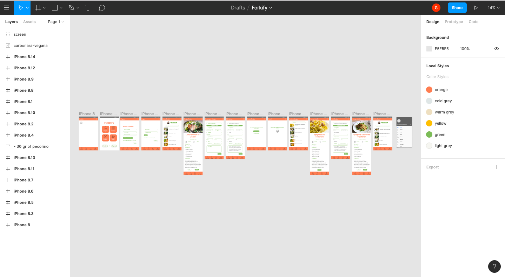

<!--  -->

# Forkify!

[Link to Heroku](https://forkify144.herokuapp.com/)

## Our project: recipe book

Forkify is for food lovers.
It is a social recipe book.
Follow your friends and explore the recipe database to see what your friends have been cooking lately.
Create and save new recipe and add ingredients to your shopping list.
All in one place.

## Why?

When you search for a recipe on internet, you get dozens of information, filled with different images, ingredients, explanations, advertisements...
And very often, all what you wish to find is only that tasty chocolate cake that your mom used to bake!
Inspired by Spotify, that among thousand of songs enables you to build your own playlist, or to listen to your friends’ and other users’ playlists, we decided to give back the user the control over what he/she wants to cook.
This is a simple virtual recipes’ book. You write and save your recipes. You can share them. Or you can “fork” your mom’s or friends’ recipes, and decide to modify them.
When you have decided what to cook, two amazing features:

- select the number of people you want to cook for, and get automatically the customised amount of each ingredients;
- then simply add the ingredients to your shopping list and go to buy what you need.
  Organise your recipes has never been so easy!

## The process: the wireframes

The process of the wireframes helped us to define the basic structure and connections of our App.
It especially helped us to be sure that our ideas and concepts were aligned and that we wanted to go in the same direction.




## The process: the flow

- Signup or Login
- Home page "My Recipes": all your recipes are saved in your profile
- "Create" if you want to create your own new recipe
- "Explore" to search recipes created by other users
- "Searchbar" works with name of the recipe, categories and also name of the creator of the recipe
- Click on a recipe to display "Recipe Detail": name, categories, time for the preparation, for how many people, list of ingredients, description of the preparation
- You can "Edit" or "Delete" your recipe
- If you open the recipe of someone else, and you like it, you can "Fork it!": it will be saved among your recipes, and you can edit it as you want, ex. "Chocolate Bundt Cake" becomes "Bolo de Chocolate", and contains 8 eggs instead of 6
- You can "Select the nr of people" you want to cook for, and you will automatically get the customised amount of each ingredients;
- Then you can "Add to shopping list" the ingredient and go to the supermarket
- Once you buy the ingredients, use the checkboxes to cancel them, or the buttons to delete them permanently
- You can share your recipe by sending the link!

## Possible improvements

1. A way to avoid food wasting;
2. A potential connection with supermarkets and the possibility to buy online the ingredients;
3. Have a personal inventory of the food in your fridge;
4. Improve the social aspects, with the possibility of visiting other people's profile;
5. Text-scanning of recipes written on books and automatically saved in the App;

## Technologies and tools

1. JavaScript (ES6), Node.js, React.js
2. HTML5
3. CSS3 and SCSS
4. Bootstrap and Reactstrap
5. Passport
6. MongoDB, Mongoose
7. Postman
8. Multer, Cloudinary

Thanks for reading
:fork*and_knife:
\_Anja, Giulia and Seb*

## Useful info

### To run the project

To execute the seeds file, run from the root of the project:

```
$ node bin/seeds.js
```

And then, in two different consoles, from the root of the project:

```
$ npm run dev:server
$ npm run dev:client
```

### Deploy Heroku

```
$ git push heroku master
```

In the console of Heroku:

```
$ node bin/seeds.js
```
